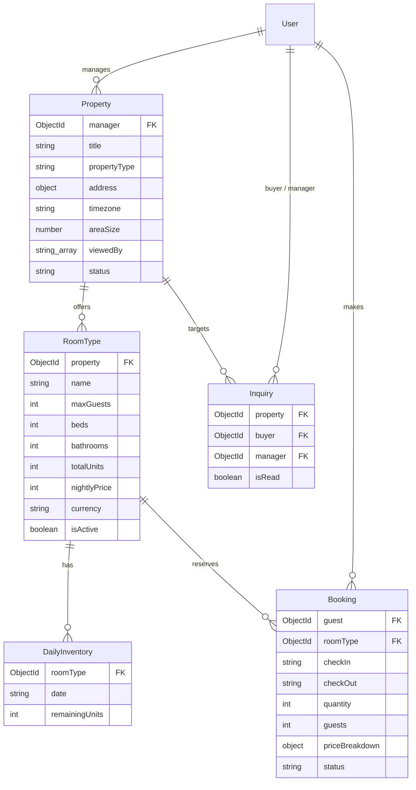
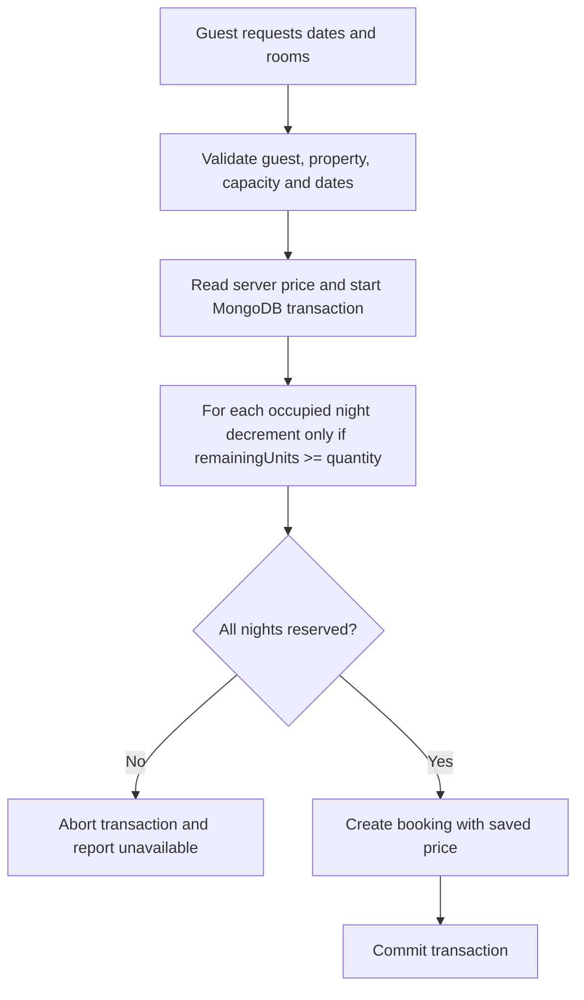

# Accommodation schema

This is the persistence design. Booking APIs, inquiry messaging, payments, inventory initialization,
reservation transactions, and cancellation logic are not implemented yet.

## Relationships



The arrows describe intended relationships. MongoDB references do not enforce that
related documents exist; future controllers must check them. All models have timestamps.

## Worked example

Riverside Hotel has a Deluxe Double room type: 10 interchangeable rooms, two guests
per room, and a base price of 800,000 VND per room per night. A whole-home homestay
uses the same model with an Entire House room type and totalUnits of one.

A guest reserves two Deluxe rooms for four people, checking in October 10 and
checking out October 13, 2026. Checkout is exclusive: three nights are reserved.

| Inventory date | Before reservation | After reservation |
| --- | --- | --- |
| 2026-10-10 | 10 | 8 |
| 2026-10-11 | 10 | 8 |
| 2026-10-12 | 10 | 8 |
| 2026-10-13 | 10 | 10 |

The booking stores priceBreakdown as currency VND, nightlyPrice 800000, nights 3,
and total 4800000. Quantity is two. Guests is the total headcount across both rooms.
The saved price is independent of later changes to RoomType.nightlyPrice.

## Field rules

- Property.timezone is required and validated by Intl.DateTimeFormat, for example
  Asia/Ho_Chi_Minh. Existing properties need their correct timezone backfilled.
- Property.areaSize is optional and currently has no measurement unit or numeric bounds.
  Property.viewedBy is an unrestricted string array; it neither verifies viewer identities
  nor prevents duplicates, and it can grow indefinitely. No view-tracking API exists yet.
- Stay dates are real YYYY-MM-DD calendar dates in that property's timezone.
  UTC is used only to count calendar days, avoiding daylight-saving duration errors.
- Counts are safe integers. Capacity, beds, totalUnits, booking quantity, and guests
  must be positive; bathrooms and remaining inventory may be zero.
- Money is a nonnegative safe integer in minor units. VND uses whole dong;
  USD and EUR use cents. These three currencies are the initial supported set.
- Booking validates checkout after check-in, the night count, and
  total = nightlyPrice × nights × quantity. This initial price has no taxes,
  discounts, additional fees, or seasonal rates.
- Booking status is confirmed or cancelled. Payment status is not modeled yet.
- DailyInventory has a unique database index on roomType + date. A missing inventory
  row does not imply availability; the application must initialize and handle it.
- Inquiry connects a prospective buyer (`User`), a property manager (`User`), and a target `Property`.
  `isRead` defaults to `false`. Inquiry endpoints and messaging flows are not yet implemented.

## Why timezone is stored on the property

The timezone identifies whose local calendar and clock govern the stay. Use the
property's location, not the guest's browser timezone or the server's timezone.
For a property in Vietnam, set timezone to Asia/Ho_Chi_Minh.

For example, 2026-10-10 at 00:30 in Vietnam is 2026-10-09 at 17:30 UTC.
A UTC server using its own current date would still call it October 9, even though
the hotel's local date is October 10. Future same-day booking checks must use the
hotel's date. Similarly, check-in at 14:00 or a cancellation cutoff at 18:00 must
be interpreted in the property's timezone. These policies are not implemented yet.

Current checkIn, checkOut, and inventory dates are date-only strings. They are not
converted to UTC timestamps, and their night-count calculation does not need the
timezone. The timezone becomes necessary when comparing a stay date with the current
local day or converting a local check-in/cutoff time to an exact instant.

Store actual event timestamps, such as createdAt, as instants; format them for display
in the relevant timezone. Use a named timezone rather than a fixed offset because
some locations change their offset during daylight-saving time. A Vietnam-only product
could use one configured timezone; the current schema stores it per property to support
properties in different locations. Validation checks that the timezone is supported,
not that it matches the supplied address.

## Safe reservation flow still to implement



Schema validation alone does not prevent double bookings. Conditional inventory updates
and booking creation must share one transaction on a replica set or sharded MongoDB
deployment. Transaction retry handling is also required.

Controllers must check active room types and published properties, manager ownership,
related document existence, and guests <= maxGuests × quantity. Inventory may not exceed
capacity; changing totalUnits must reconcile existing daily inventory without invalidating
reservations. Cancel only through a transaction that transitions confirmed to cancelled
and restores each night's inventory exactly once. A direct status update is insufficient.

Do not accept client-supplied priceBreakdown, status, or inventory values in guest requests.
Do not hard-delete referenced room types or properties while bookings need them.
Document pre-validation runs on validate/save, not on query updates such as updateOne;
runValidators does not execute the booking's document pre-validation hook.

Run focused database-free checks from server/:

```bash
node --experimental-strip-types --test tests/property.model.test.ts tests/accommodation.model.test.ts
```

These tests verify validation and index declarations, not database index installation,
transactions, concurrent reservations, or cancellation. Those require integration tests
when the booking flow is implemented.
