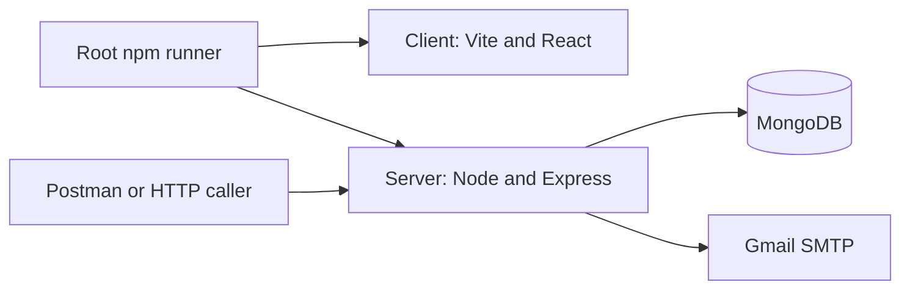
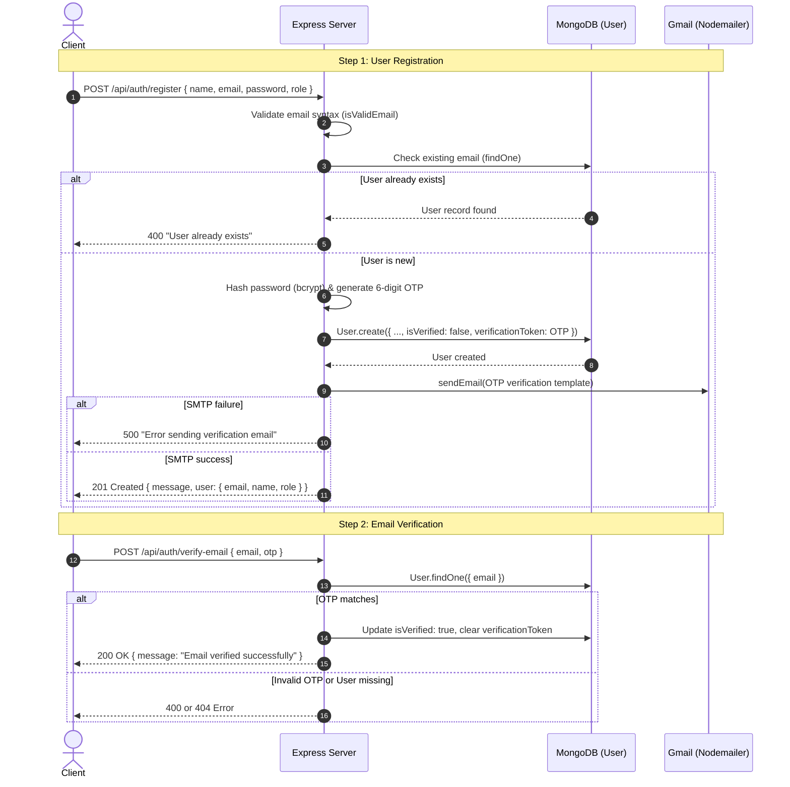
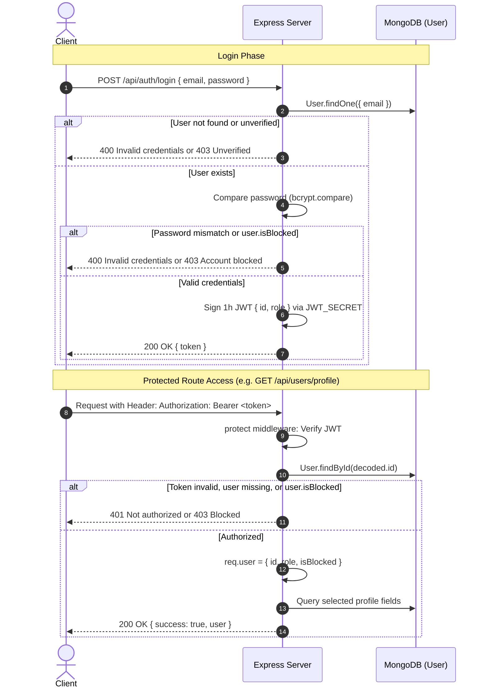
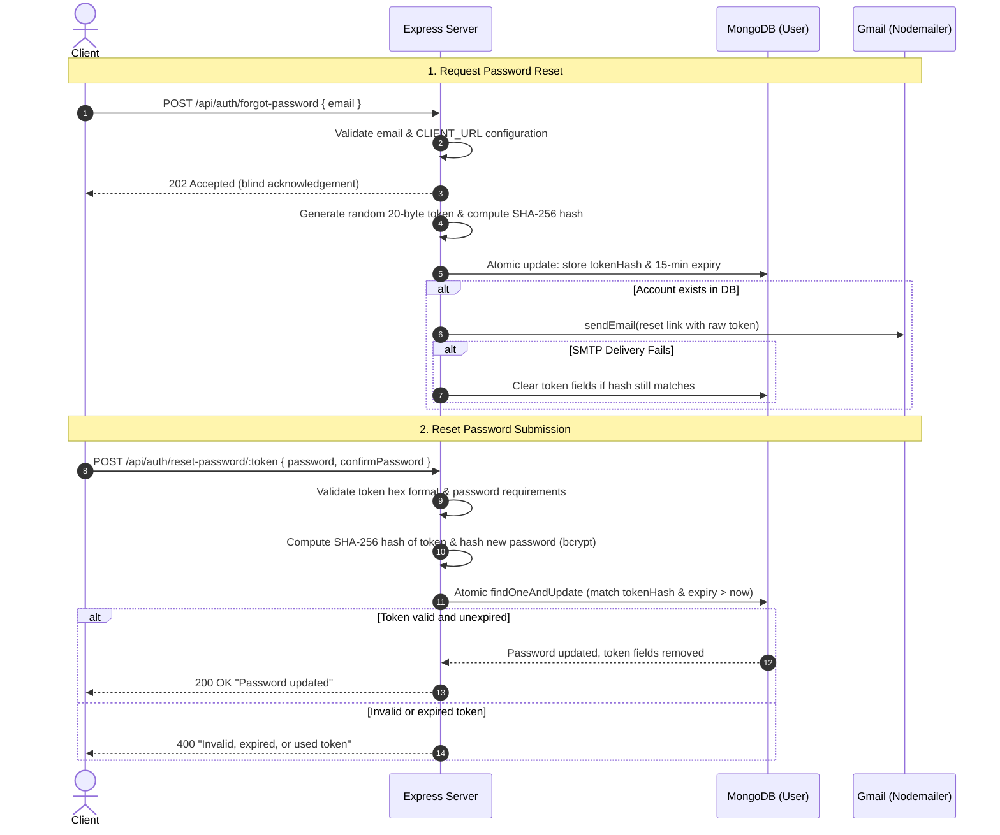
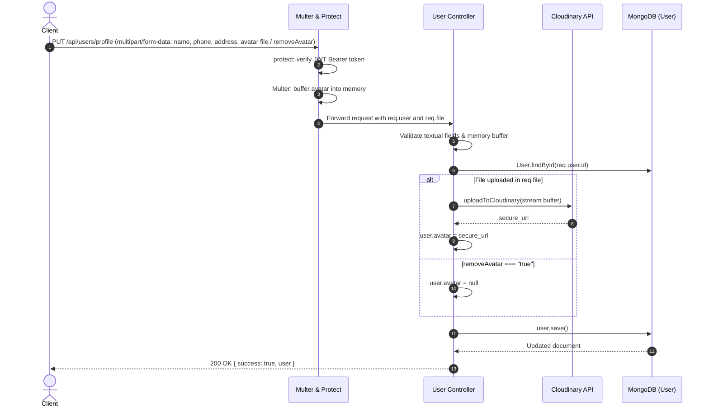

# HomiePlace architecture

## Package boundaries

The client currently makes no backend requests. The root package orchestrates development
processes; it does not share dependencies or source between packages. Mounted HTTP handlers
use the User model and utility functions directly; no service or repository layer exists.

| Path | Responsibility |
| --- | --- |
| `client/src/` | React entry, placeholder App, and Tailwind CSS |
| `server/server.ts` | Environment loading, database startup, middleware, route mounting, listening |
| `server/config/` | MongoDB connection |
| `server/controller/` | HTTP handlers, request/response types, and barrel exports |
| `server/middleware/` | Profile authentication, unattached role middleware, and Multer memory storage |
| `server/routes/` | Auth and user routers with shared barrel exports |
| `server/models/` | User, Property, RoomType, DailyInventory, Booking, and Inquiry schemas with named model exports |
| `server/tests/` | Database-free schema validation tests |
| `server/utils/` | Email, email validation, trusted links, and utility exports |
| `server/utils/templates/` | Verification email HTML and template exports |
| `docs/` | Shared developer reference |
| `.agent/` | Agent overview and links to shared guides |

## Source layout and runtime

`client/src/main.tsx` renders `BrowserRouter > App`; App is a placeholder without routes or API requests. Tailwind v4 is enabled in CSS and Vite. The default client port is 5173.

`server/server.ts` loads dotenv, awaits `config/db.ts`, and starts Express on port 5000. CORS is unrestricted and JSON bodies are limited to 10 KB. A database connection failure prevents startup. No centralized error middleware, rate limiter, or Socket.io initialization exists.

Handlers and request/response interfaces live in `server/controller/`. The user schema in `server/models/user.model.ts` stores identity, unique email, bcrypt password hash, roles, account flags, verification/reset tokens, expiry, and timestamps. `server/utils/` contains Gmail delivery, verification email HTML, trusted client-link construction, and email validation.

Each package has its own npm manifest and lockfile. The private root package uses concurrently to run the existing client/server development scripts with `npm --prefix`, preserving each package's working directory. Root Prettier configuration provides shared formatting with a 90-column target and one JSX attribute per line. Each package has an ESLint flat configuration; VS Code configures separate ESLint working directories and Prettier format on save. The server manifest still declares `main: server.js`; the runtime entry is `server.ts`. The server tsconfig uses NodeNext resolution for native aliases configured in package.json: `#controller`, `#utils`, `#templates`, `#models`, `#middleware`, and `#routes` target barrels, while `#*` maps individual source paths to `./*.ts`. The client has no source aliases. There is no server typecheck script.

## Mounted routes

| Method | Path | Behavior |
| --- | --- | --- |
| GET | `/` | Returns `Hello World` |
| POST | `/api/auth/register` | Runs registration and sends a verification OTP; validation and role authorization remain unfinished |
| POST | `/api/auth/login` | Checks credentials and account flags, then signs a one-hour JWT |
| POST | `/api/auth/verify-email` | Compares the OTP and marks the account verified |
| GET | `/api/auth/profile` | Uses `protect`; returns the user-module selected profile fields |
| GET | `/api/users/profile` | Protected selected profile fields |
| PUT | `/api/users/profile` | Protected profile update and optional avatar upload |
| GET | `/api/users/profile/:id` | Public selected profile fields by MongoDB ID |
| POST | `/api/auth/forgot-password` | Accepts an email and processes reset delivery in the current process |
| POST | `/api/auth/reset-password/:token` | Consumes a valid token and replaces the password hash |

## Execution flow diagrams

### 1. Registration and email verification

### 2. Login and protected route authorization

### 3. Password reset flow

### 4. Profile update and avatar upload

## Password-reset flow

1. Validate email and the configured client origin before acknowledging a request. Return 400 for invalid email or 503 for invalid client configuration.
2. Return the same 202 response for existing and nonexistent accounts before querying MongoDB. This does not confirm email delivery.
3. Generate a 20-byte random token, store its SHA-256 hash with a 15-minute expiry, and email the original token through the Gmail helper. The password remains unchanged.
4. On SMTP failure, remove token fields only if the stored hash still matches that request, preserving a newer request's token. Processing runs in the Node process and does not survive restarts.
5. Reset accepts a 40-character lowercase hexadecimal token and matching passwords of at least 15 Unicode code points and at most 72 UTF-8 bytes. An atomic update checks expiry, saves a bcrypt hash, and removes token fields. Invalid, expired, or used tokens return 400; success returns 200.

Both handlers send `Cache-Control: no-store`. Reset does not issue a login token or change approval, verification, or blocked flags. The frontend reset page and rate limiting are deferred; no automated test files are retained.

## Shared helpers

`isValidEmail(unknown)` narrows valid strings using basic syntax and a 254-character limit. Registration, login, verification, and forgot-password call it before email queries. It does not normalize addresses or verify ownership.

`buildClientUrl(path)` reads `CLIENT_URL`, requires an HTTPS origin without credentials, path, query, or fragment, and rejects resulting links outside that origin. HTTP localhost, 127.0.0.1, and IPv6 loopback are allowed outside production. Request headers never supply the reset-link origin.

## Auth routing and controllers

Registration validates email, hashes passwords, creates users, sends a six-digit OTP, and responds with user details. Role authorization and complete boundary validation remain unfinished; public registration must not grant privileged roles. Its OTP uses Math.random, and verification does not enforce expiry despite the email template mentioning ten minutes.

Login checks password and account flags and signs a one-hour JWT using `JWT_SECRET`. Both mounted profile-read endpoints load a user by `req.user.id` and select identity, contact, avatar, role, and timestamp fields. The renamed auth-module `getUserDetail` remains exported but unmounted. Verification compares the stored OTP and marks the account verified. These handlers are mounted through `server/routes/auth.routes.ts`, with `authRouter` mounted at `/api/auth`. Profile uses `protect`, which checks the loaded user for blocked status and attaches `req.user` before calling `next()` once. A separate user-module controller is mounted at `GET /api/users/profile`. `authorizeRoles` is exported but not attached to any route.

Profile updates run `protect`, then `upload.single("avatar")` using Multer memory storage. The user controller validates optional name, phone, and address fields, uploads a supplied buffer through Streamifier to Cloudinary, and saves its secure URL. `removeAvatar` clears the URL only for the exact string `"true"` when no file is supplied. Public lookup validates the ID and selects name, avatar, role, and creation time. Upload size/type limits and Cloudinary asset cleanup are absent. Socket.io remains installed but unintegrated.

See [API reference](api.md) for contracts, [Data model](data-model.md) for persistence,
and [Implementation status](implementation-status.md) for specific integration gaps.
