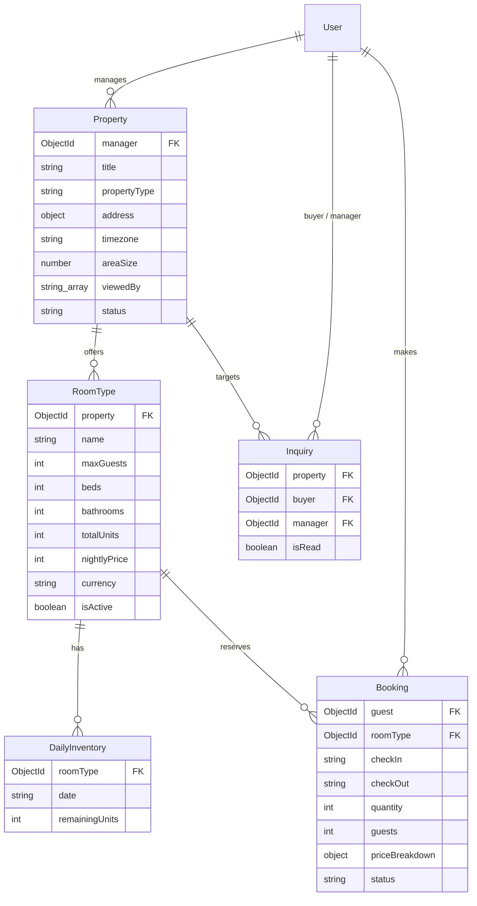

# Database schema

## Schema relationships

References describe intended relationships; MongoDB does not enforce that related
documents exist. All models have timestamps.

## User model

The user model is `User`, defined in
[server/models/user.model.ts](../../server/models/user.model.ts) and exported as a named value
through `#models`. MongoDB persistence uses Mongoose; no migration or seed script exists.

| Field | Type | Constraint or default |
| --- | --- | --- |
| `_id` | ObjectId | Generated by MongoDB |
| `name` | String | Required |
| `email` | String | Required, unique index; no schema normalization |
| `password` | String | Required; controllers store bcrypt hashes |
| `role` | String | `user`, `manager`, or `admin`; defaults to `user` |
| `phone` | String | Optional |
| `avatar` | String | Optional Cloudinary secure URL; profile removal sets null |
| `address` | String | Optional |
| `isBlocked` | Boolean | Defaults to `false` |
| `isApproved` | Boolean | Schema default `true`; registration sets `false` for manager input |
| `isVerified` | Boolean | Defaults to `false` |
| `verificationToken` | String | Optional six-digit registration OTP stored as plaintext |
| `resetPasswordToken` | String | Optional SHA-256 digest of the emailed reset token |
| `resetPasswordExpires` | Date | Reset expiry, set to 15 minutes after a request |
| `createdAt`, `updatedAt` | Date | Managed by Mongoose timestamps |

## Persistence behavior

Registration checks for an existing email before creating a user. The unique index remains
the database constraint; the lookup does not prevent concurrent duplicate inserts.
Registration currently maps unexpected failures, including duplicate-key races, to 500.

Password reset uses an atomic `findOneAndUpdate` that requires both a matching token hash
and future expiry. It replaces the password and removes the token fields together. This
prevents the same token from being consumed twice. Failed email cleanup matches the stored
hash before removing fields, preserving a newer request's token.

Profile updates save only name, phone, address, and an uploaded avatar URL (or null on removal). The controller trims text fields and leaves role, email, and password unchanged. Cloudinary asset deletion is not implemented.

There is no TTL index, verification-expiry field, or roommate schema.
Expired reset fields may remain stored until replaced or cleared; expiry is checked during reset.

## Property model

`Property` is defined in `server/models/property.model.ts` and exported through `#models`.
It describes an accommodation establishment, not an individual room or booking.

- Required: trimmed title (up to 200 characters), description (up to 10,000),
  property type, structured address, timezone, and a manager reference to `User`.
- Types: hotel, homestay, resort, hostel, guesthouse, apartment, villa, and house.
- Address: addressLine, city, province, and country are required; area and postalCode
  are optional. Postal codes remain strings to preserve leading zeroes.
- Amenities are trimmed, nonempty strings. Images are HTTPS URLs without credentials.
- `areaSize` is an optional Number. The schema currently defines no measurement unit,
  minimum, or integer constraint; it does not reject negative values.
- Status: draft (default), published, or archived. Verification defaults to false.
- Views default to zero and must be a nonnegative safe integer. `viewedBy` is an
  array of strings with no identity format, uniqueness, or size constraint. It has
  no enforced relationship to the views counter. Creation/update timestamps are enabled.

The earlier unexported draft's sale price, room dimensions, furnishing, seller,
and sale/sold statuses are replaced by this accommodation model; property-level
areaSize and viewedBy are present in the current schema. Existing draft-shaped
documents, if stored externally, need migration before use; no migration is run here.

Room capacity, inventory, nightly pricing/currency, and saved reservations are modeled
by RoomType, DailyInventory, and Booking. See the [relationship diagram](database-schema.md#schema-relationships)
and [accommodation field rules](accommodation-schema.md). Property also requires a valid timezone.
See [why the property needs a timezone](accommodation-schema.md#why-timezone-is-stored-on-the-property)
for local stay dates, check-in times, and booking cutoffs.
No property API or booking flow exists yet.
Future controllers must validate input, check manager existence and permissions, and
restrict verification changes to authorized staff. A User reference does not enforce
these rules. Publication requirements must be enforced before publishing a listing.

Run the database-free validation checks from `server/`:
`node --experimental-strip-types --test tests/property.model.test.ts`.

## Inquiry model

`Inquiry` is defined in [server/models/inquiry.model.ts](../../server/models/inquiry.model.ts) and exported through `#models`.
It records inquiries submitted by prospective buyers or tenants for a specific property.

| Field | Type | Constraint or default |
| --- | --- | --- |
| `_id` | ObjectId | Generated by MongoDB |
| `property` | ObjectId | Required; references `Property` |
| `buyer` | ObjectId | Required; references `User` (inquiry sender) |
| `manager` | ObjectId | Required; references `User` (property manager) |
| `isRead` | Boolean | Defaults to `false` |
| `createdAt`, `updatedAt` | Date | Managed by Mongoose timestamps |

No inquiry API endpoints or message exchange flows are implemented yet. Controllers will need to validate referenced IDs, ensure the manager matches the property, and authorize buyer and manager access before exposing read or update actions.

## When extending the model

Validate HTTP input at runtime before persistence. A TypeScript interface or Mongoose enum
does not authorize public input to select an admin role. Preserve uniqueness and timestamps,
handle duplicate-key errors deliberately, and define response fields explicitly. Excluding
only `password` from a query still leaves token and other internal fields available; profile
reads and updates use explicit selected fields. The exported, unmounted `getUserDetail` handler still excludes only the password. Never include credential or token values in logs.
