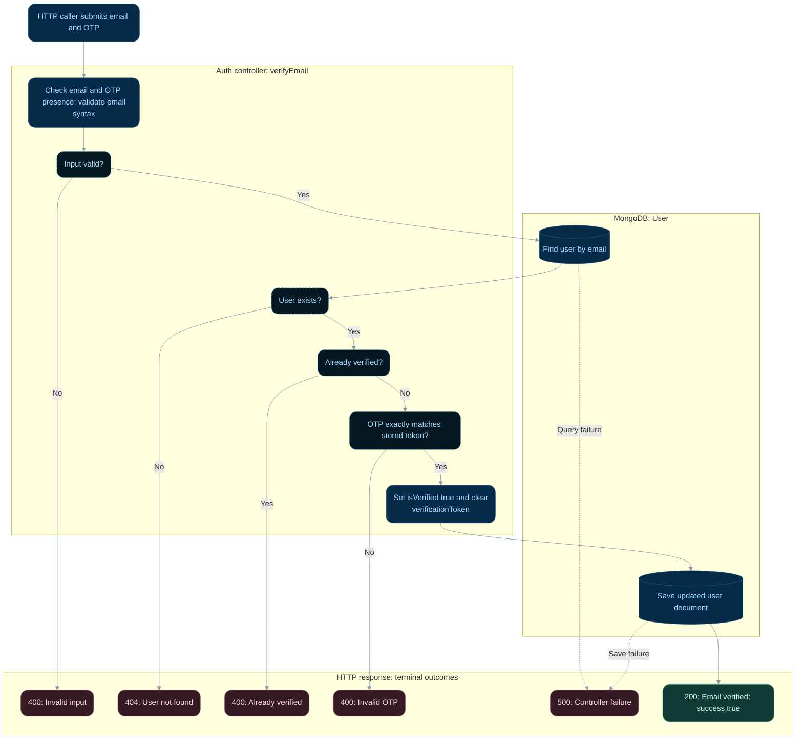

# Email verification

**Status:** Implemented backend flow with documented gaps.
**Endpoint:** `POST /api/auth/verify-email`

## Flow

## Behavior and limitations

OTP comparison is exact. The handler does not check OTP expiry, despite the expiry
mentioned in the email template. Unexpected failures return 500.

Next: [Login](login.md).

Source: [controller](../../server/controller/auth/auth.controller.ts). See the
[API reference](../api.md), [implementation gaps](../implementation-status.md),
and [flow index](README.md).

## State changes and review scenarios

Successful verification saves `isVerified: true` and removes `verificationToken` in the
user document. Lookup and save are separate operations; this is not an atomic token
consumption operation like password reset. An unchanged OTP is accepted regardless of age.

Source-based scenarios to verify; these requests were not run as part of this documentation change:

| Scenario | Expected response | Persistent effect |
| --- | --- | --- |
| Matching OTP on unverified account | 200 | Account verified and OTP cleared |
| Incorrect OTP | 400 | Account unchanged |
| Already verified account | 400 | Account unchanged |
| User save fails | 500 | Verification is not confirmed to the caller |
