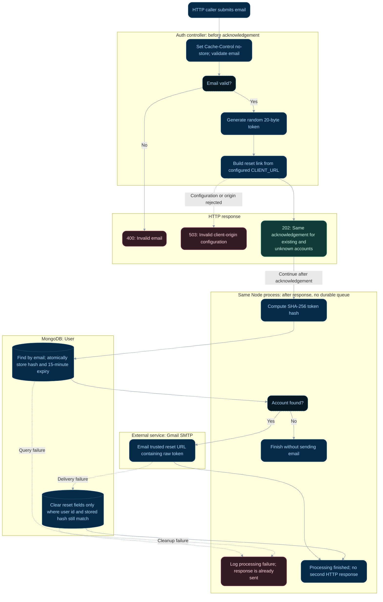

# Request a password reset

**Status:** Implemented backend flow with documented gaps.
**Endpoint:** `POST /api/auth/forgot-password`

## Flow

## Behavior and limitations

The same 202 response is sent before database lookup for existing and unknown accounts.
It does not confirm delivery. Work is not queued durably and does not survive restarts.
Processing failures are logged; they cannot change the response already sent. Both reset
endpoints send `Cache-Control: no-store`.

Next: [Submit a new password](reset-password.md).

Source: [controller](../../server/controller/auth/auth.controller.ts). See the
[API reference](../api.md), [implementation gaps](../implementation-status.md),
and [flow index](README.md).

## State changes and review scenarios

A new request replaces any previous reset hash and expiry. SMTP cleanup includes both
user id and that request's hash, so it does not clear a newer request's token. The raw
token is emailed; only its SHA-256 hash is persisted. A process exit after acknowledgement
can interrupt processing without notifying the caller.

Source-based scenarios to verify; these requests were not run as part of this documentation change:

| Scenario | Expected response | Persistent effect |
| --- | --- | --- |
| Valid known email and successful delivery | 202 before lookup/delivery | New hash and 15-minute expiry stored |
| Valid unknown email | Same 202 | No user update and no email |
| SMTP fails | Already-sent 202 remains | Matching reset fields cleared if cleanup succeeds |
| New request replaces token before old SMTP cleanup | Both callers already received 202 | Old cleanup leaves newer hash intact |
