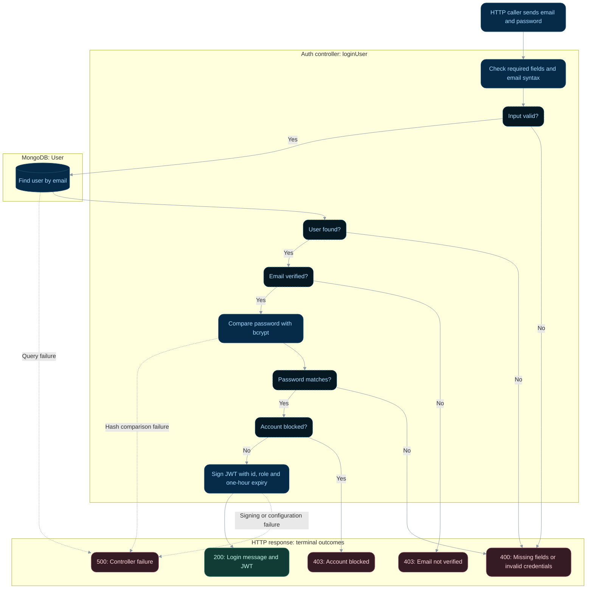

# Login

**Status:** Implemented backend flow with documented gaps.
**Endpoint:** `POST /api/auth/login`

## Flow

## Behavior and limitations

The chart follows the current check order: verification precedes password comparison,
and blocked status follows it. `isApproved` is not checked. Signing requires `JWT_SECRET`;
unexpected failures, including signing failures, return 500.

Next: [Protected profile reads](protected-profile.md).

Source: [controller](../../server/controller/auth/auth.controller.ts). See the
[API reference](../api.md), [implementation gaps](../implementation-status.md),
and [flow index](README.md).

## State changes and review scenarios

Login reads account state and creates a signed token; it does not update the user or
persist a session. The JWT carries id and role, but protected requests reload the user
from MongoDB and use its current role and blocked status. No refresh-token flow is mounted.

Source-based scenarios to verify; these requests were not run as part of this documentation change:

| Scenario | Expected response | Persistent effect |
| --- | --- | --- |
| Verified, unblocked account with matching password | 200 with one-hour JWT | No user write |
| Missing user or incorrect password | 400 | No user write |
| Unverified or blocked account | 403, following the check order above | No user write |
| Missing signing secret or database failure | 500 | No session is persisted |
