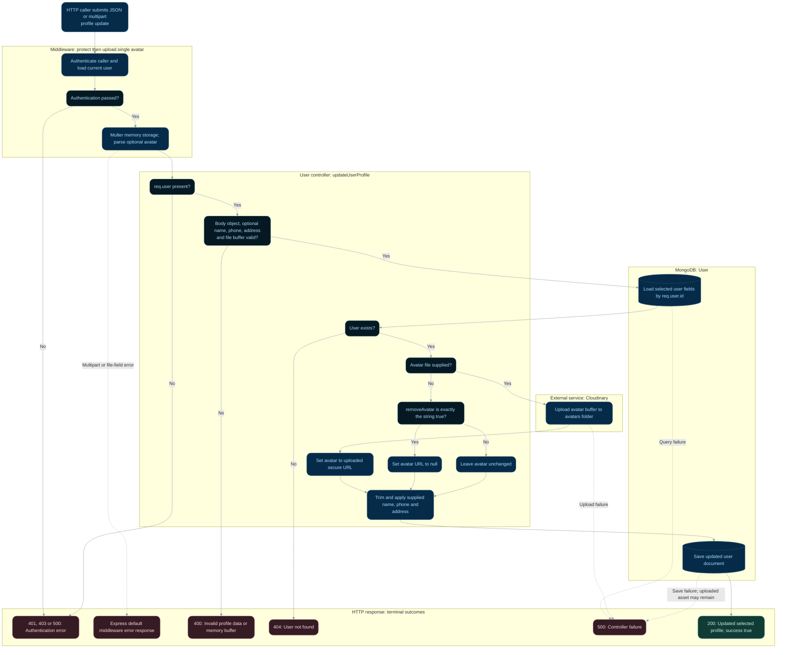

# Profile update and avatar upload

**Status:** Implemented backend flow with documented gaps.
**Endpoint:** `PUT /api/users/profile`

## Flow

## Behavior and limitations

The file takes precedence over the exact string `removeAvatar="true"`; a JSON boolean
does not remove an avatar. Text-only updates do not need Cloudinary credentials. Upload
or save failures return 500; Multer can reject before the controller and uses default
Express error handling. See [protected reads](protected-profile.md) for authentication.

Uploads have no size/type limits. Replacing or removing an avatar does not delete its
Cloudinary asset; an upload followed by a failed save can leave an unused asset.

Source: [controller](../../server/controller/user/user.controller.ts). See the
[API reference](../api.md), [implementation gaps](../implementation-status.md),
and [flow index](README.md).

## State changes and review scenarios

MongoDB and Cloudinary are separate write boundaries with no shared transaction. The
controller uploads first and saves the user second. A save failure can leave an orphaned
asset. Replacing/removing the URL does not delete the old asset. This flow does not allow
body fields to change role, email, password, or set an arbitrary avatar URL.

Source-based scenarios to verify; these requests were not run as part of this documentation change:

| Scenario | Expected response | Persistent effect |
| --- | --- | --- |
| Valid text-only update | 200 | Supplied allowed fields trimmed and saved; no upload |
| Avatar file plus removeAvatar string true | 200 if upload/save succeed | Uploaded URL wins; old Cloudinary asset remains |
| Cloudinary upload fails | 500 | Updated profile is not saved |
| Upload succeeds but MongoDB save fails | 500 | Uploaded asset can remain without a saved user reference |
