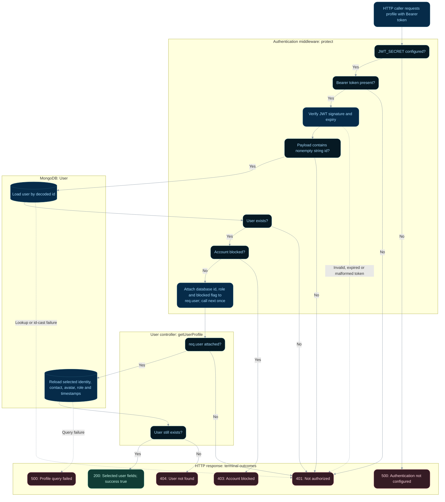

# Protected profile reads

**Status:** Implemented backend flow with documented gaps.
**Endpoint:** `GET /api/auth/profile` or `GET /api/users/profile`

## Flow

## Behavior and limitations

Both routes use the same user-module controller. `protect` authenticates and rejects
blocked users; it does not enforce roles, verification, or approval. `authorizeRoles`
is not mounted. Middleware lookup/verification errors return 401; controller query
errors return 500. Password and token fields are excluded from the profile response.

Source: [protect middleware](../../server/middleware/auth.middleware.ts).

Source: [controller](../../server/controller/user/user.controller.ts). See the
[API reference](../api.md), [implementation gaps](../implementation-status.md),
and [flow index](README.md).

## State changes and review scenarios

This flow has two database reads and no writes. The second read can return 404 if the
account disappears after authentication. Profile projection prevents credential/token
fields from appearing in the controller response. A token's role is not treated as the
current authorization source; `protect` reloads account state.

Source-based scenarios to verify; these requests were not run as part of this documentation change:

| Scenario | Expected response | Persistent effect |
| --- | --- | --- |
| Valid JWT for existing unblocked user | 200 with selected profile fields | No writes |
| Missing, expired, or invalid JWT | 401 | No writes |
| Account blocked after token issuance | 403 on next request | No writes |
| Middleware database lookup fails | 401 under current catch handling | No writes; error is not distinguished from invalid auth |
