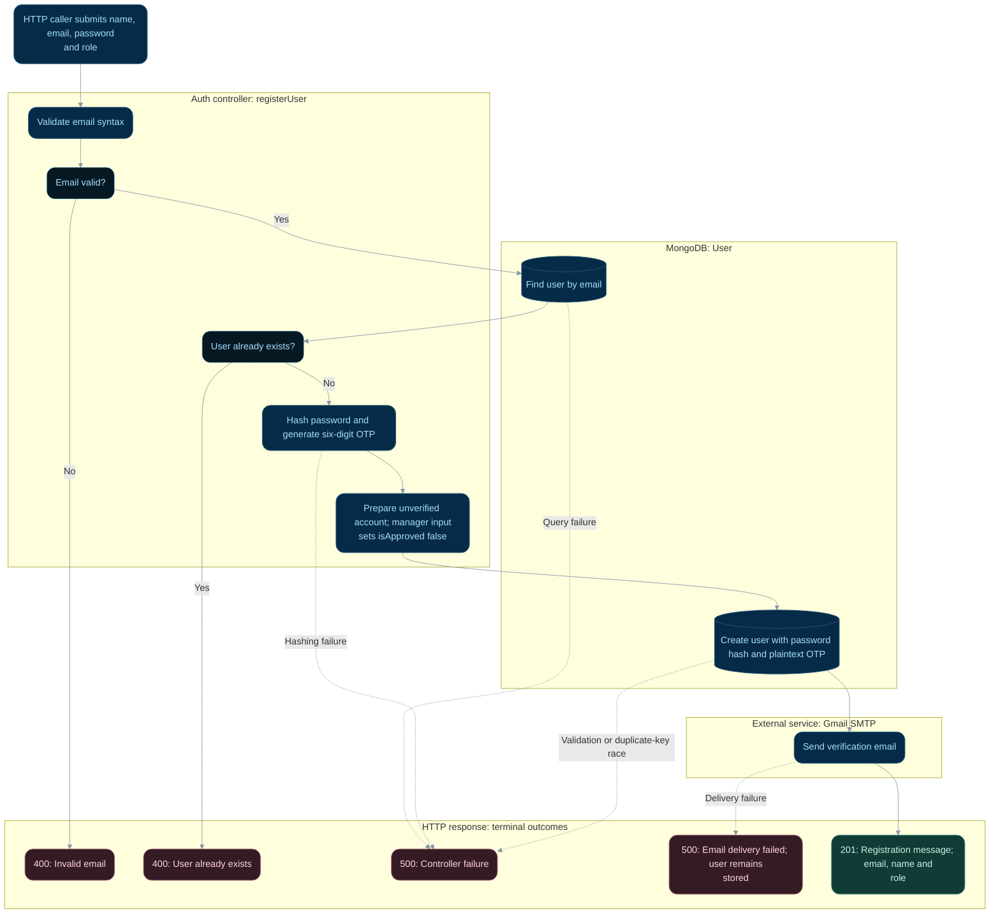

# User registration

**Status:** Implemented backend flow with documented gaps.
**Endpoint:** `POST /api/auth/register`

## Flow

## Behavior and limitations

Only email syntax is explicitly validated before the lookup. Complete boundary validation
and privileged-role authorization remain unfinished. OTP generation uses `Math.random`,
expiry is not enforced, and there is no resend route. Unexpected failures return 500.

Next: [Email verification](email-verification.md).

Source: [controller](../../server/controller/auth/auth.controller.ts). See the
[API reference](../api.md), [implementation gaps](../implementation-status.md),
and [flow index](README.md).

## State changes and review scenarios

A successful database insert persists the account before SMTP delivery. There is no
transaction spanning MongoDB and SMTP, and a failed email does not roll back the user.
The pre-insert lookup does not prevent concurrent inserts; the unique email index is
the constraint, and a duplicate-key race currently becomes 500 rather than 400.

Source-based scenarios to verify; these requests were not run as part of this documentation change:

| Scenario | Expected response | Persistent effect |
| --- | --- | --- |
| New email and successful SMTP | 201 | Unverified user and OTP stored; password hashed |
| Email already present at lookup | 400 | No new account |
| SMTP fails after insert | 500 | Account and OTP remain; retry can return already exists |
| Concurrent inserts for same email | One insert can succeed; losing duplicate-key request returns 500 | Unique index must exist in MongoDB to enforce uniqueness |
