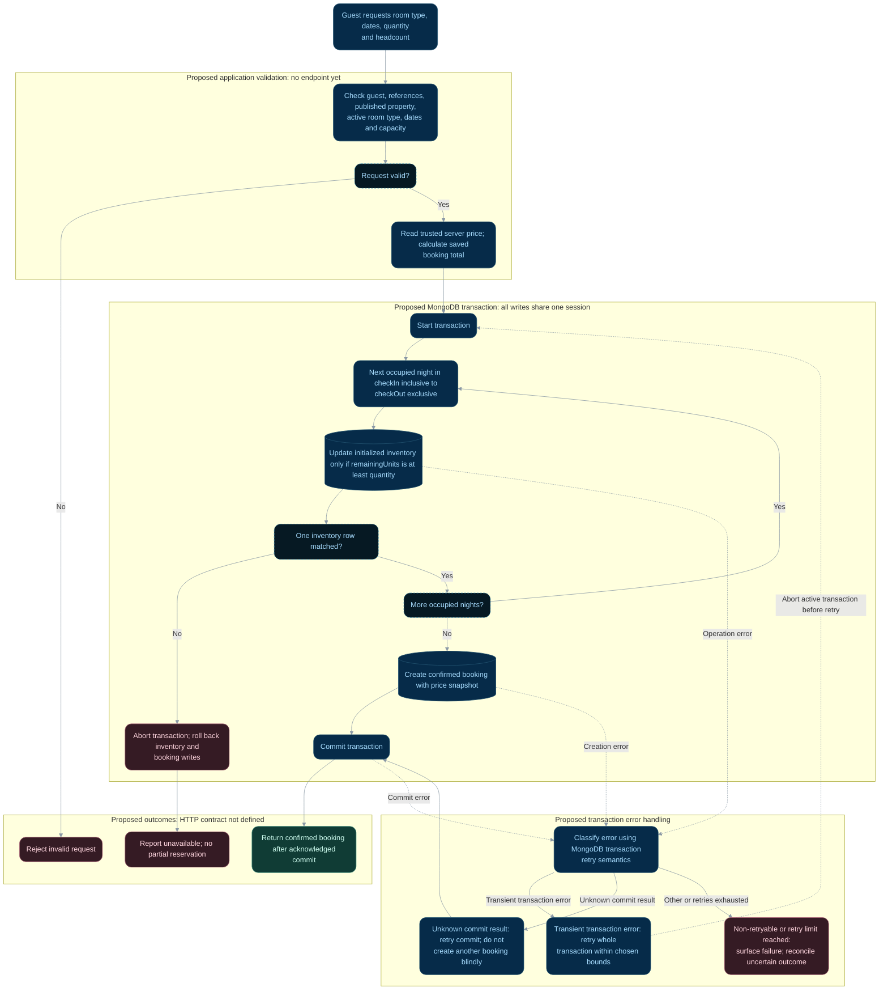

# Reservation flow

**Status:** Proposed; not implemented. There is no booking endpoint yet.

## Flow

## Behavior and limitations

This design reserves `[checkIn, checkOut)`: checkout does not consume inventory. Each
night's update must require `remainingUnits >= quantity`. Missing inventory rows do not
imply availability. Inventory and booking writes must share a transaction; error and
retry handling must follow MongoDB transaction semantics.

Never accept client-supplied price, status, or inventory values. Cancellation must
transition status and restore inventory exactly once in a separate transaction.
See [accommodation constraints](../architecture/accommodation-schema.md#safe-reservation-flow-still-to-implement),
[schema relationships](../architecture/database-schema.md#schema-relationships), and
[flow index](README.md).

## Transaction boundaries and future acceptance checks

This is a design for future implementation, not a description of existing controllers.
A replica set or sharded MongoDB deployment is needed for transactions. All inventory
updates and booking creation must use the same session. Retry bounds, idempotency keys,
HTTP status codes, and recovery after an uncertain commit are not defined yet.

An unknown commit result is different from a confirmed abort: retry the commit according
to driver semantics, and do not blindly repeat booking creation. A transient transaction
error can require retrying the entire transaction. Choose a driver-supported transaction
API when implementing this flow and test its retry behavior against the deployment.

These are future acceptance checks, not executed tests:

| Scenario | Required result |
| --- | --- |
| Two guests compete for the last unit on an occupied night | Inventory never becomes negative; only the available quantity is confirmed |
| A later night has no inventory or insufficient units | Abort all earlier decrements; no booking persists |
| Booking creation fails after inventory updates | Roll back both inventory and booking writes |
| Commit result is uncertain or a transaction is retried | Resolve commit state without blindly creating duplicate bookings; define idempotency/recovery before rollout |
