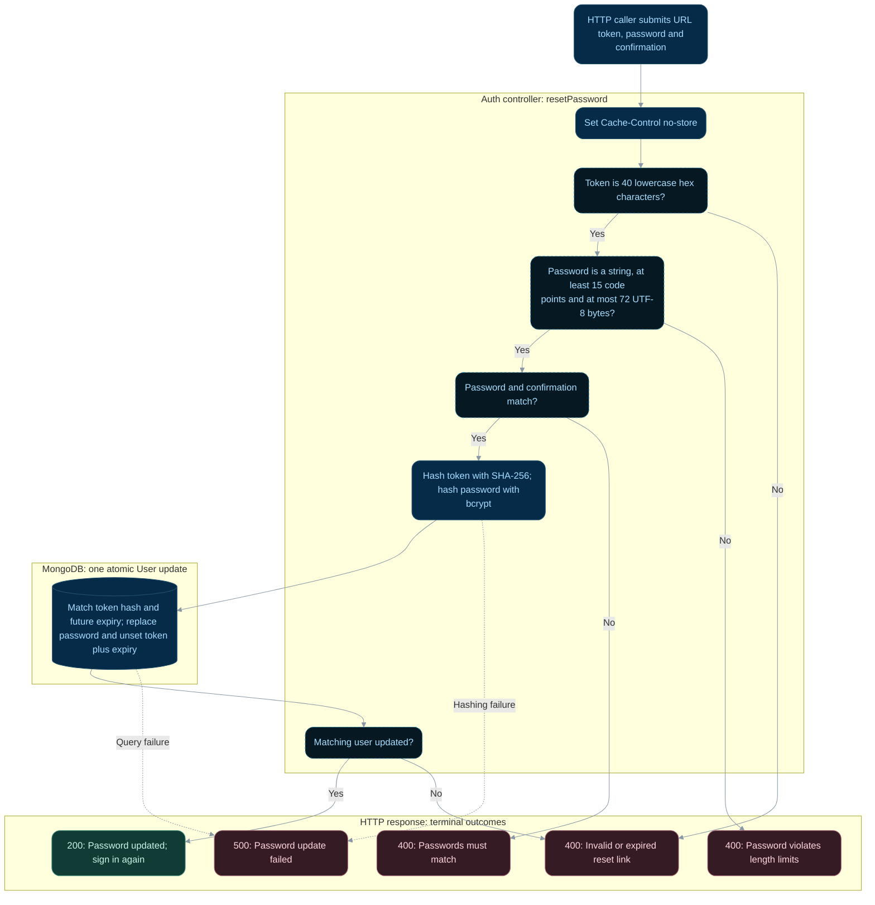

# Submit a new password

**Status:** Implemented backend flow with documented gaps.
**Endpoint:** `POST /api/auth/reset-password/:token`

## Flow

## Behavior and limitations

Passwords require at least 15 Unicode code points and at most 72 UTF-8 bytes. The atomic
update makes the token single use. Unexpected failures return 500. Reset does not issue
a JWT or alter approval, verification, or blocked flags. The frontend reset page is absent.
Both reset endpoints send `Cache-Control: no-store`.

Source: [controller](../../server/controller/auth/auth.controller.ts). See the
[API reference](../api.md), [implementation gaps](../implementation-status.md),
and [flow index](README.md).

## State changes and review scenarios

The password hash replacement and reset-field removal are one atomic update, conditional
on the token hash and a future expiry. Two requests cannot both consume the same stored
token. A separate, newer reset request can replace the hash before consumption.

Source-based scenarios to verify; these requests were not run as part of this documentation change:

| Scenario | Expected response | Persistent effect |
| --- | --- | --- |
| Valid unused token and matching valid passwords | 200 | Password replaced; reset fields removed |
| Expired, replaced, or already-used token | 400 | Password unchanged by this request |
| Concurrent submissions using the same token | At most one 200; others 400 | Only one atomic update matches |
| Invalid password length or mismatched confirmation | 400 | No database update |
